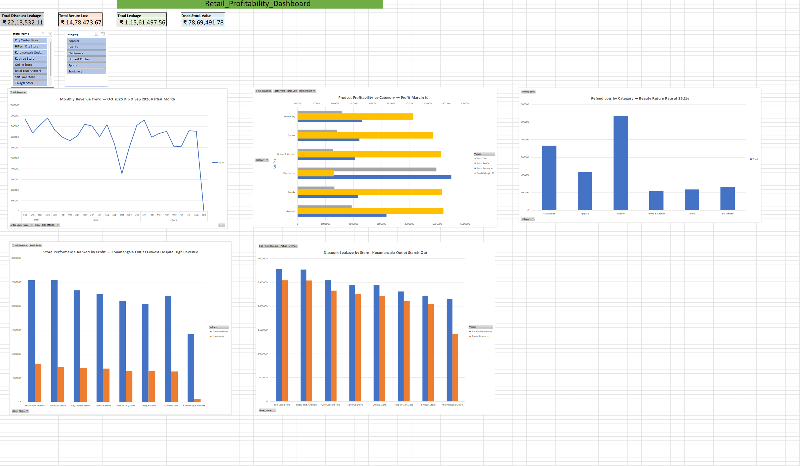

# 📊 Retail Profitability & Revenue Leakage Intelligence System


An end-to-end data analytics project that uncovers **₹1.15 Crore in hidden revenue leakage** in a simulated retail business — using SQL for data modeling and analysis, and an interactive Excel dashboard for visualization and stakeholder communication.

---

## 🎯 Business Problem

A retail business can look healthy on the surface — steady revenue, popular products — while quietly losing significant money through inefficiencies that don't show up in a basic sales report. This project asks: **where exactly is a retail business leaking revenue, and how much?**

The analysis targets four specific leakage patterns, each deliberately built into the synthetic dataset to simulate a realistic investigation:

1. A high-revenue product that is actually **losing money on every sale**
2. A store location that is **discounting far more aggressively** than its peers
3. A product category with an **abnormally high return rate**
4. **Dead stock** — inventory that has never sold a single unit

---

## 🖼️ Dashboard Preview


*(Screenshot of the interactive Excel dashboard — replace this image with your own export before publishing)*

The dashboard features 4 KPI summary cards, 5 linked charts, and 2 cross-filtering slicers (by store and by product category) built on a Power Pivot data model.

---

## 🔑 Key Findings

| # | Finding | Impact |
|---|---|---:|
| 1 | **Dead stock** — 3 products never sold a single unit | ₹78,69,491.78 |
| 2 | **Koramangala Outlet** discounts at 33.69% avg vs. ~8% elsewhere | ₹22,13,532.11 total discount leakage (₹7,23,086.40 from this store alone) |
| 3 | **Beauty category** returns at 25.2% vs. 4–7% elsewhere | ₹14,78,473.67 total return loss (₹5,35,441 from Beauty alone) |
| 4 | **Bluetooth Speaker Pro (Value Edition)** — top seller by revenue, but **-3.75% profit margin** | Loses money on every unit sold |
| 5 | Genuine **43.76% revenue dip** in Oct 2025, distinct from a partial-month data artifact in Sep 2026 | Flagged for follow-up investigation |

**Total Revenue Leakage Identified: ₹1,15,61,497.56**

📄 Full findings and recommendations: [`Business_Insights_and_Recommendations.md`](./Business_Insights_and_Recommendations.md)

---

## 🛠️ How It Was Built

### Phase 1 — Database Design (Oracle SQL Developer)
- 8 relational tables (`rpl_customers`, `rpl_products`, `rpl_stores`, `rpl_payments`, `rpl_orders`, `rpl_order_items`, `rpl_inventory`, `rpl_returns`)
- Synthetic dataset: 2,000 orders across 24 months, with 4 patterns deliberately planted for the analysis to uncover
- All 8 CSVs imported and validated against expected row counts

### Phase 2 — SQL Analysis (7 queries)
- Product profitability (revenue, cost, profit, margin %)
- Store profit ranking (`RANK()` window function)
- Discount leakage by store
- Return loss by category
- Dead stock detection (`NOT IN` subquery)
- Month-over-month revenue trend (`LAG()` window function)
- Total leakage summary combining all three leakage sources

### Phase 3 — Excel Dashboard (Power Query, Power Pivot, DAX)
- All 8 tables cleaned via Power Query and loaded into a single Data Model with verified relationships
- Custom DAX measures for revenue, cost, profit, discount leakage, and dead stock value — **independently cross-verified against the SQL results, matching to the rupee**
- 5 PivotCharts (product profitability, store performance, discount leakage, return analysis, monthly trend)
- 4 KPI summary cards
- Fully interactive dashboard with 2 cross-filtering slicers connected across multiple charts

---

## 📁 Repository Structure

```
├── README.md
├── Business_Insights_and_Recommendations.md
├── sql/
│   └── retail_leakage.sql (7 analysis queries — profitability, ranking, leakage, returns, dead stock, trend, summary)
├── data/
│   └── (8 CSV source files)
├── excel/
│   └── Retail_Profitability_Dashboard.xlsx
└── assets/
    └── dashboard_preview.png
```

---

## 📌 Notes on Methodology

Every headline figure in this project was calculated twice — once in SQL, once in Excel/DAX — and cross-verified to match exactly. This was a deliberate choice to demonstrate that the same business question can be answered consistently across tools, and to catch errors that a single-tool analysis might miss.

---

## 👤 Author

**Jansi Rani**
Data Analyst | SQL · Excel · Power BI
📍 Neyveli, Tamil Nadu

*This project was built as part of a data analyst portfolio targeting analytics roles.*
